# Introduction

OpenFAST is a modular, extensible, and open-source software platform created for simulating and analyzing wind turbine systems, including both offshore and onshore configurations. It is developed and maintained by the National Renewable Energy Laboratory (NREL).

However, OpenFAST lacks a graphical user interface (GUI), which leads to a steep learning curve, manual input file handling, and limited visualization features. This makes it difficult for beginners and prone to errors in complex workflows. To overcome these challenges, users often need to rely on third-party tools or custom scripts, which increases the required effort and technical expertise.

EnkelFAST is a personal project aimed at creating a graphical user interface (GUI) for OpenFAST. The name "Enkel," meaning "easy" in Norwegian, was inspired by my cherished memories of living in Norway. The current version, v1.0_3.4.1, reflects two components: "1.0" represents the GUI version, while "3.4.1" indicates the corresponding targeted version of OpenFAST.

EnkelFAST's source code is currently integrated into a shared codebase used for all my projects, so it has not yet been released as open-source. However, compiled binaries are available in the release section of this repository, and you can get started by using the EnkelFast.exe file.

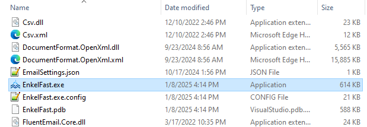

If you encounter any bugs or have suggestions for improving the tool, please feel free to reach out via email at forest.gou@hotmail.com.

## Main window
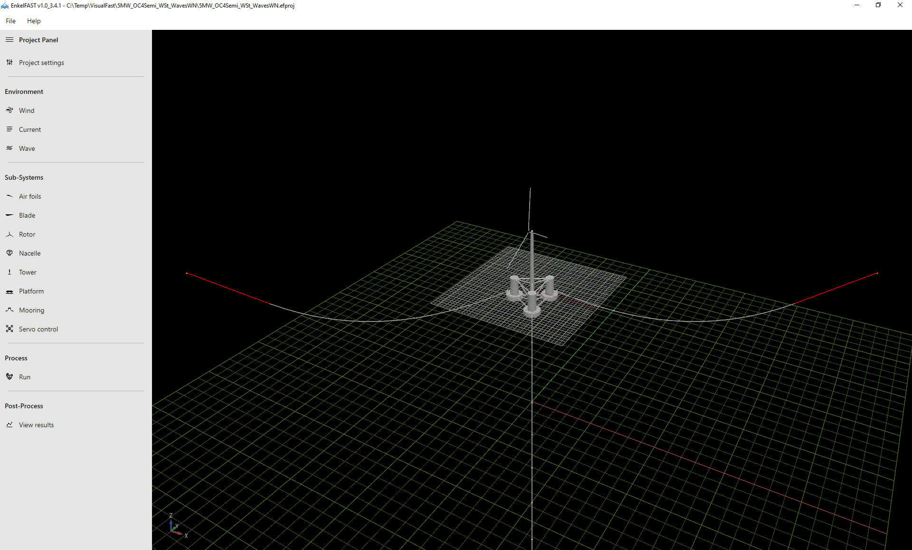

## Environment
### Project settings
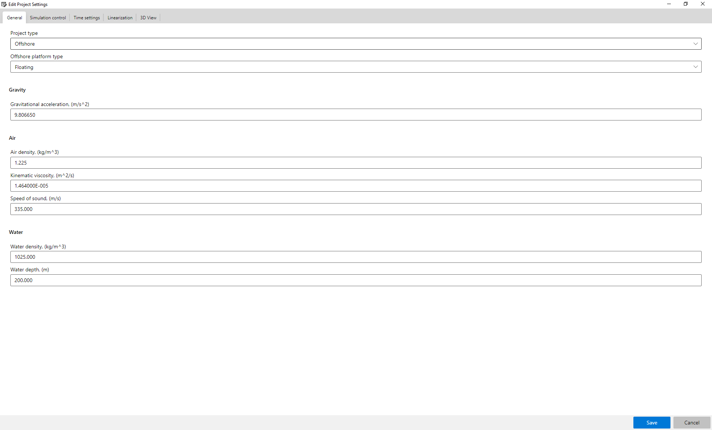

### Wind
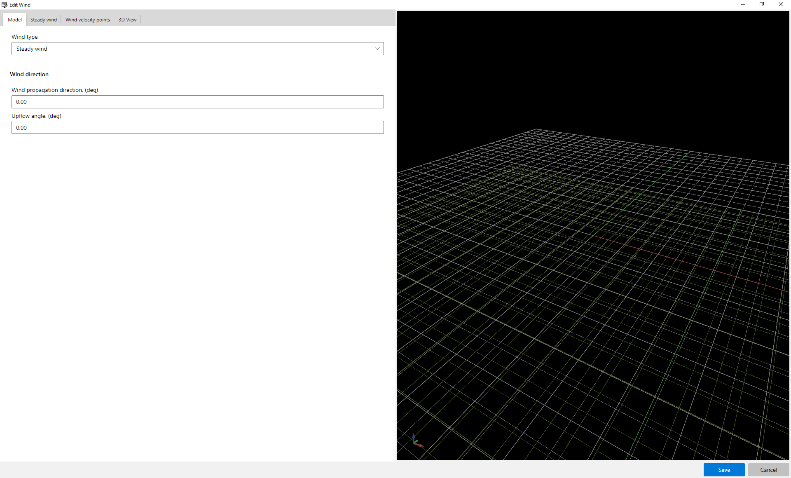

### Current
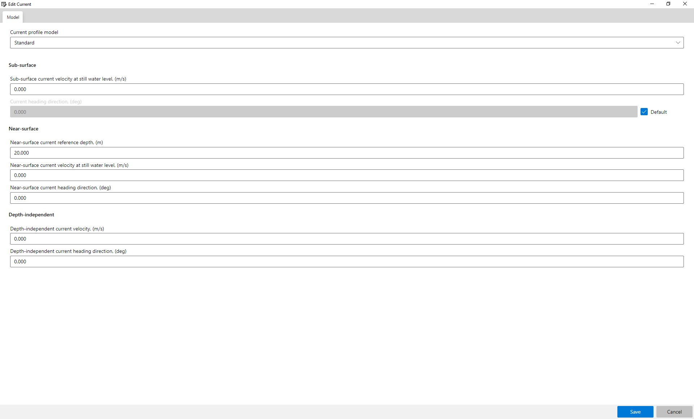

### Wave

## Sub-Systems
### Air foils
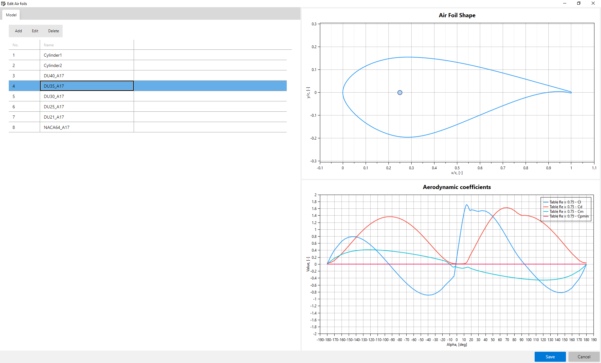

### Blade
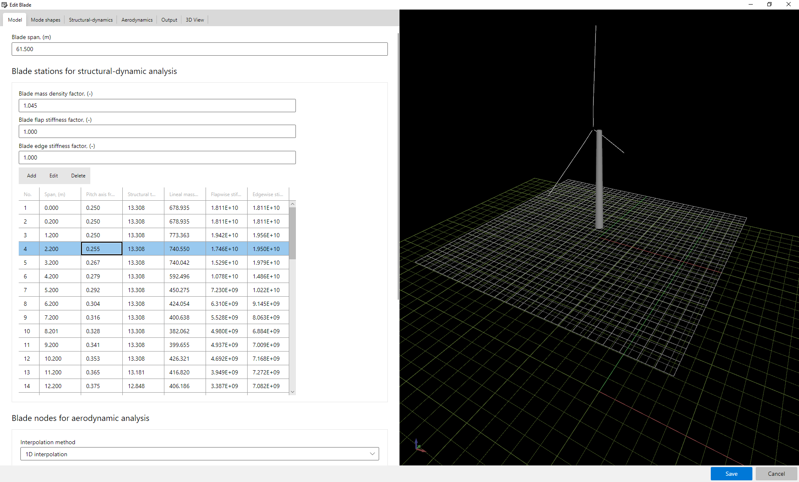

### Rotor
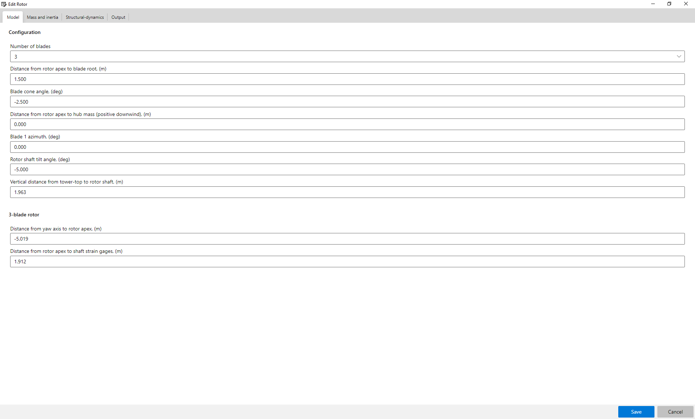

### Nacelle
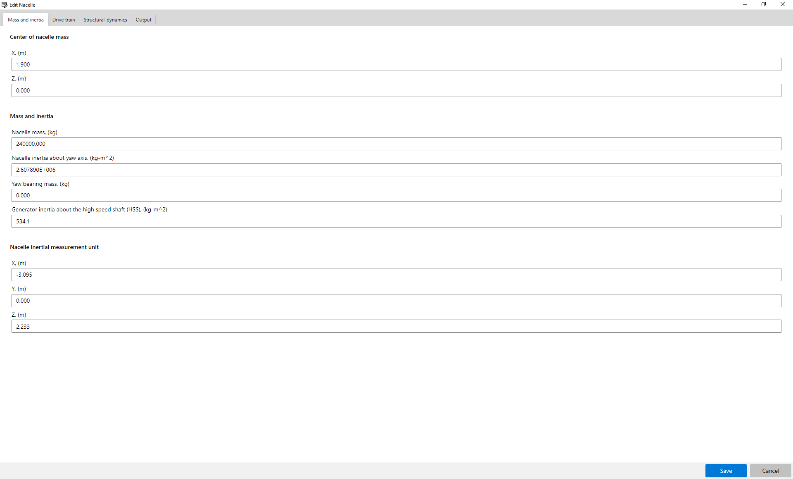

### Tower
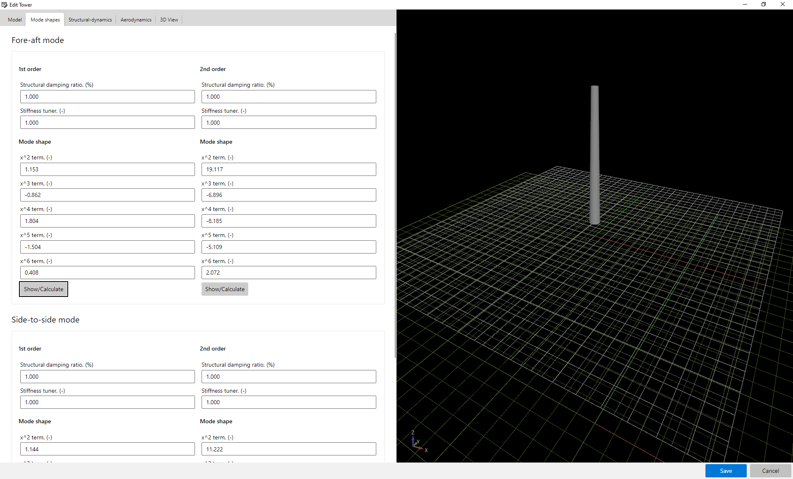

### Platform
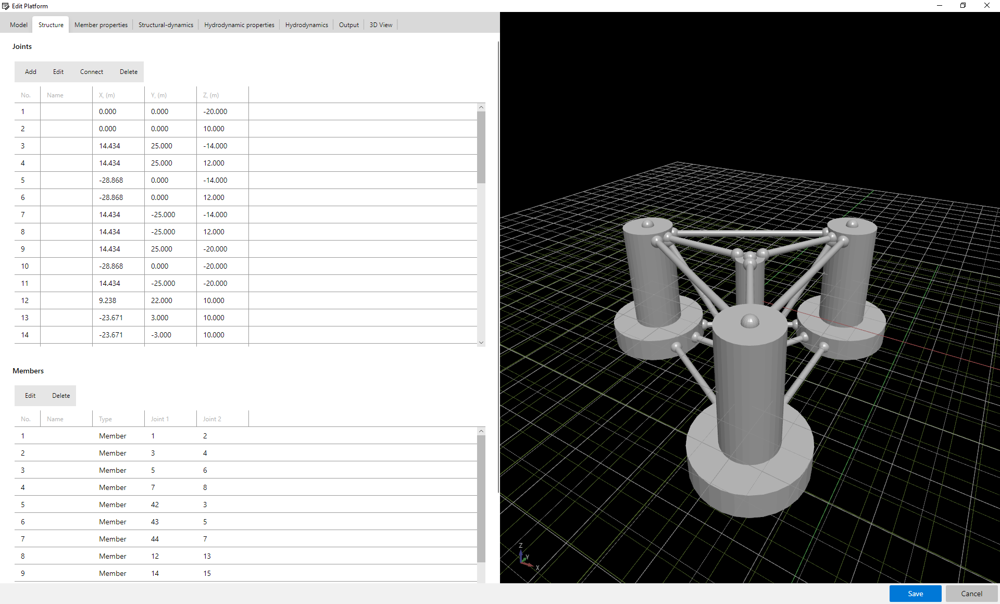

### Mooring
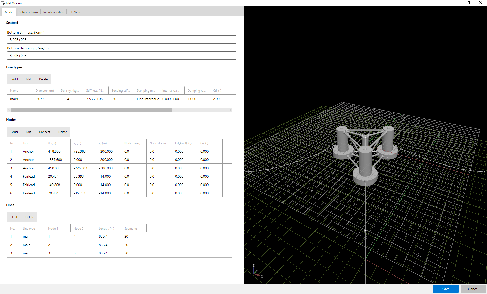

### Servo control
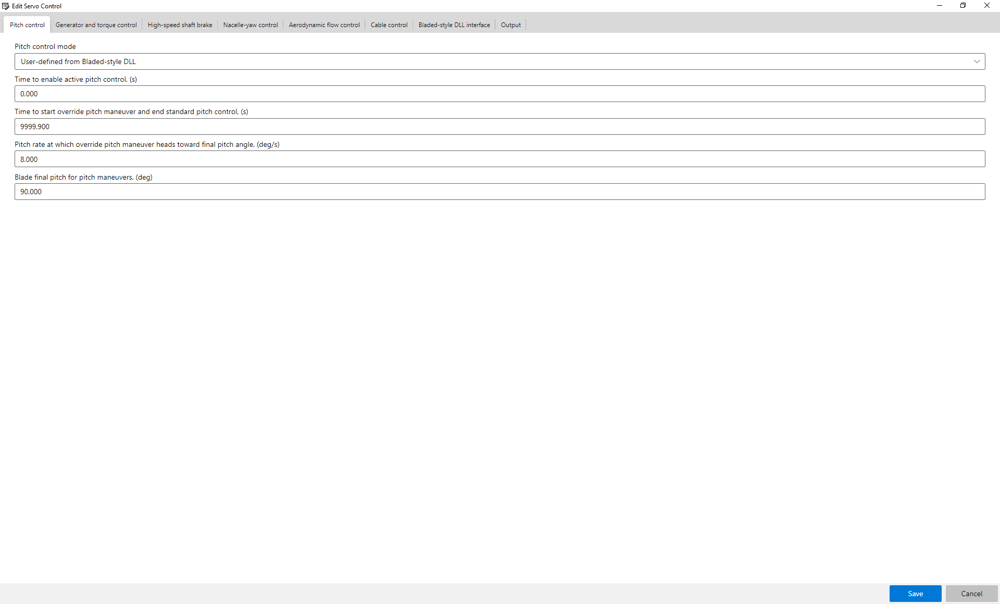

## Process
### Run
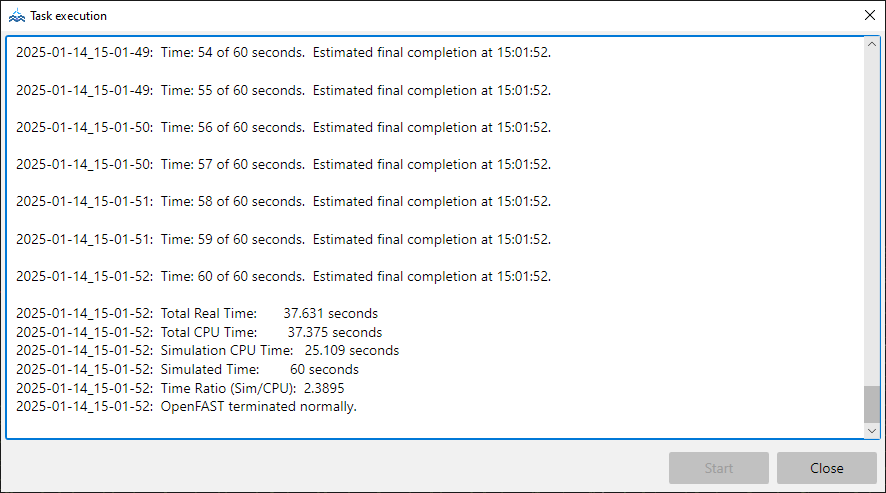

## Post-Process
### View results
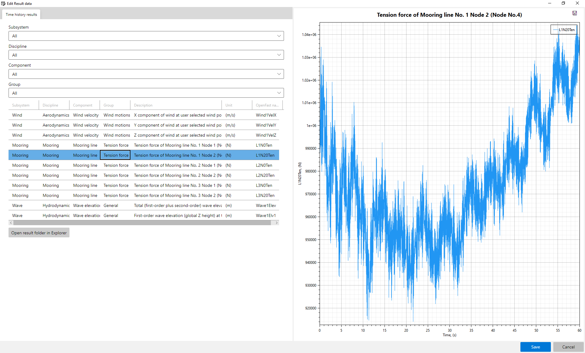